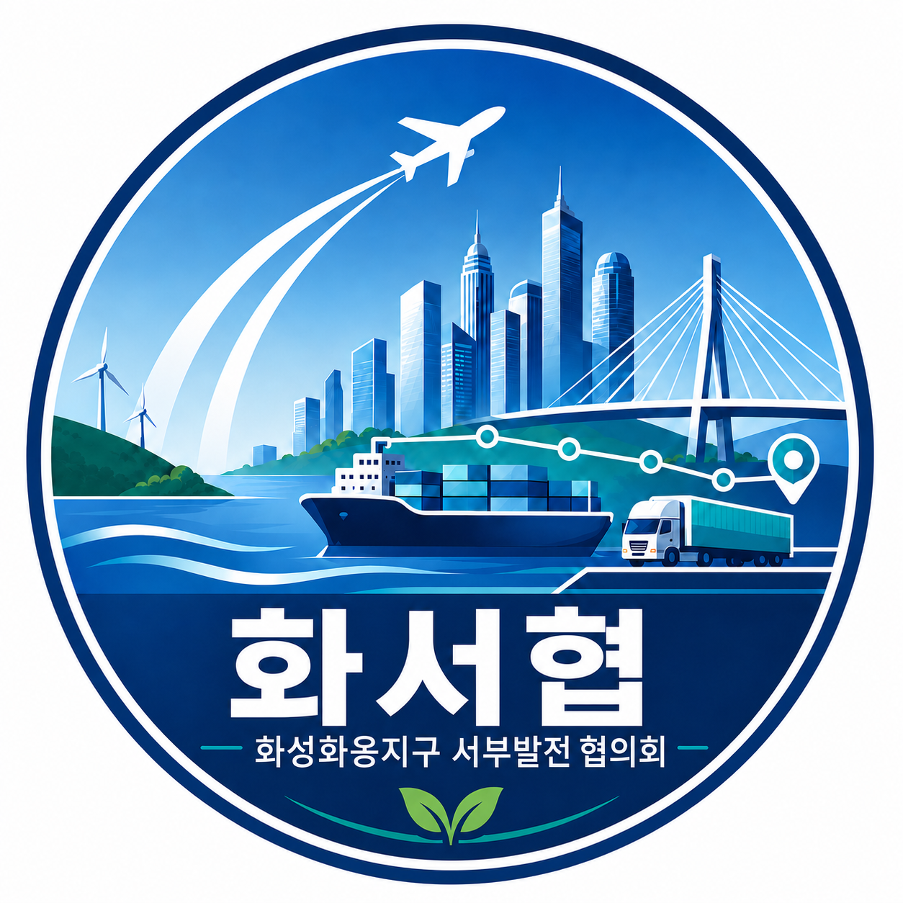
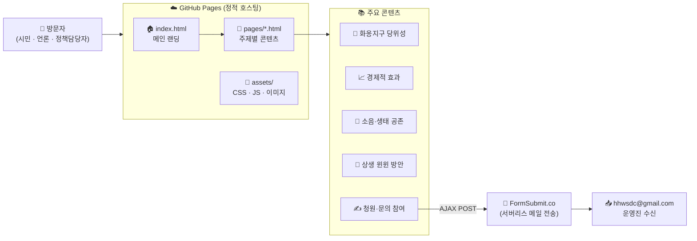
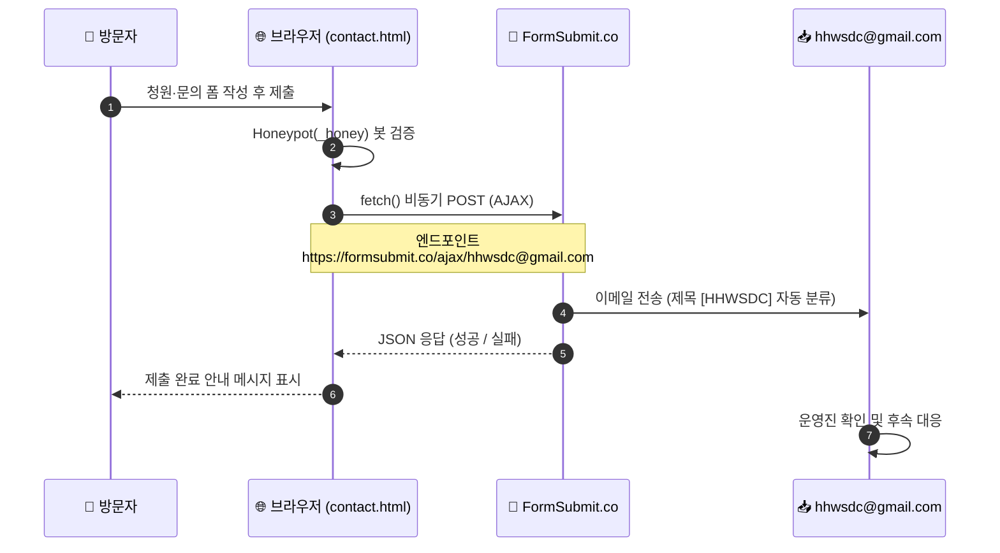
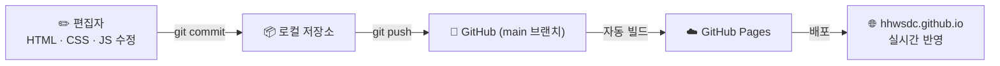

# HHWSDC - 화성화옹지구 서부발전 협의회 (화서협) 공식 웹사이트

  

[화성화옹지구 서부발전 협의회 (화서협) 공식 웹사이트](https://hhwsdc.github.io/)

경기남부권의 항공수요, 물류 경쟁력, 그리고 수도권 남부와 서해안권의 균형발전을 도모하기 위한 화성화옹지구 서부발전 협의회 (화서협)(HHWSDC)의 공식 웹페이지 저장소입니다.

## 🔎 한눈에 보기 (At a Glance)

방문자가 정적 웹사이트에서 콘텐츠를 열람하고, 청원·문의 폼을 통해 서버 없이 운영진에게 의견을 전달하기까지의 전체 구조입니다.

| 구성 요소 | 역할 | 설명 | 경로 |
|---|---|---|---|
| `docs/index.html` | 🏠 메인 | 협의회 소개·핵심 메시지를 담은 랜딩 페이지 | [바로가기](./docs/index.html) |
| `docs/pages/` | 📄 콘텐츠 | 당위성·경제효과·소음·상생 윈윈·정책·청원 등 주제별 페이지 | [바로가기](./docs/pages/) |
| `docs/assets/` | 🎨 정적 리소스 | 스타일(CSS)·동작(JS)·이미지 등 프런트엔드 자원 | [바로가기](./docs/assets/) |
| FormSubmit.co | 📧 폼 처리 | 백엔드 서버 없이 문의·청원 폼을 이메일로 전송하는 서버리스 서비스 | 외부 서비스 |
| GitHub Pages | ☁️ 호스팅 | `main` 브랜치의 `docs/` 를 정적 웹사이트로 자동 배포 | 외부 서비스 |

## 🔄 동작 흐름 (Operation Flow)

### 1. 청원·문의 제출 흐름 (Runtime Data Flow)

방문자가 폼을 제출하면, 별도의 서버 없이 FormSubmit 서버리스 서비스를 거쳐 운영진 이메일로 실시간 전달됩니다.

### 2. 콘텐츠 배포 흐름 (Build & Deploy Flow)

편집자가 소스를 수정해 `main` 브랜치에 푸시하면, GitHub Pages가 자동으로 빌드·배포하여 실시간 웹사이트에 반영합니다.

> 💡 **핵심 설계 원칙 — "서버 없이, 정적으로, 누구나 기여 가능하게"**
> 별도의 백엔드 서버 없이 GitHub Pages 정적 호스팅과 FormSubmit 서버리스 메일 전송만으로 운영하여, 운영 비용을 최소화하고 유지보수를 단순화했습니다.

## 🏛️ 주요 역할 및 소개
* **설립 목적**: 개발이 정체된 화옹지구의 균형 발전을 이루고 경기국제공항 유치를 통해 지역 경제 활성화를 추진하는 시민 협의회입니다.
* **주요 활동**: 지리적 우위, 산업 시너지, 소음 영향 분석 등 실증 조사를 기반으로 정부와 지자체에 건설적 정책 제안을 제출합니다.
* **최신 업데이트**: 재선에 성공한 정명근 화성시장의 공식 입장 및 우려점(안전성, 생태계, 주민 갈등 등)을 면밀히 분석하고, 이를 극복하기 위한 민간단체의 공론화 대응 전략을 홈페이지에 신규 반영하였습니다.

## 🔗 링크 및 문의처
* **공식 웹사이트**: [https://hhwsdc.github.io/](https://hhwsdc.github.io/)
* **공식 GitHub 저장소**: [https://github.com/hhwsdc/](https://github.com/hhwsdc/)
* **공식 연락처 및 이메일**: [hhwsdc@gmail.com](mailto:hhwsdc@gmail.com)

## 📩 문의 폼 및 이메일 전송 (FormSubmit 연동)
본 웹사이트의 **청원 참여 및 문의 폼**([contact.html](./docs/pages/contact.html))은 정적 페이지 환경에서 서버리스로 이메일을 전송할 수 있는 **FormSubmit.co** 서비스를 사용합니다.

* **전송 방식**: AJAX (`fetch` API) 비동기 POST 요청
* **API 엔드포인트**: `https://formsubmit.co/ajax/hhwsdc@gmail.com`
* **주요 보안 및 관리 설정**:
  * **스팸 방지 (Honeypot)**: 봇의 자동 제출을 차단하기 위해 숨겨진 필드 `_honey` 사용
  * **캡차 비활성화 (`_captcha: false`)**: 백그라운드 AJAX 전송을 방해하지 않도록 캡차 비활성화
  * **이메일 제목 커스텀 (`_subject`)**: `[HHWSDC] 새로운 의견 및 지지 표명 서명 제출` 로 자동 분류 설정
* **최초 활성화 방법**:
  1. 홈페이지 문의 폼에 테스트 정보를 입력하여 제출을 진행합니다.
  2. 수신 이메일 주소(`hhwsdc@gmail.com`)로 전송된 **"FormSubmit Activation"** 활성화 메일을 확인합니다.
  3. 메일 내부의 **"Activate Form"** 버튼을 클릭하면 활성화가 완료되며, 이후의 모든 제출 건은 정상 수신됩니다.

## 📂 공식 문서 자료 목록 (`./docs/document/` 폴더)
`./docs/document/` 디렉토리에 보관된 홍보 및 청원서 자료 목록입니다.

| 파일명 | 파일 형식 | 상세 설명 | 파일 경로 |
| :--- | :---: | :--- | :--- |
| `01_화성화옹지구_서부발전협의회_청원요약서_20260321.pdf` | PDF 문서 | 국토교통부 장관 및 경기도 지사에게 제출된 공식 청원서의 주요 핵심 내용을 요약한 문서 | [바로가기](./docs/document/01_화성화옹지구_서부발전협의회_청원요약서_20260321.pdf) |
| `02_화성화옹지구_서부발전협의회_경기국제공항추진_청원서_2026321.pdf` | PDF 문서 | 경기국제공항 화옹지구 입지 확정과 조속한 추진을 촉구하는 상세 공식 청원서 본문 | [바로가기](./docs/document/02_화성화옹지구_서부발전협의회_경기국제공항추진_청원서_2026321.pdf) |
| `poster_must_be_hh_20260601.png` | PNG 이미지 | 화성화옹지구 경기국제공항 유치 추진을 위한 HHWSDC 공식 A3 포스터/팸플릿 홍보 이미지 | [바로가기](./docs/document/poster_must_be_hh_20260601.png) |
